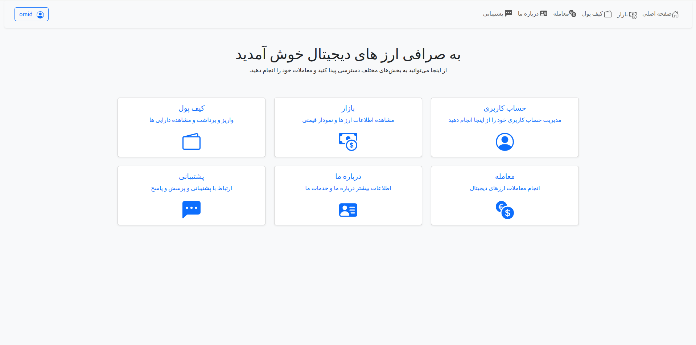
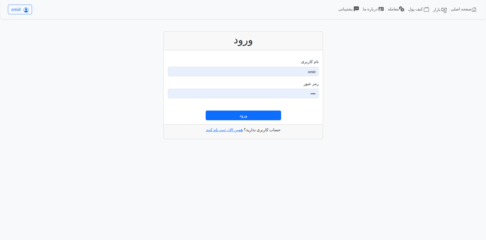
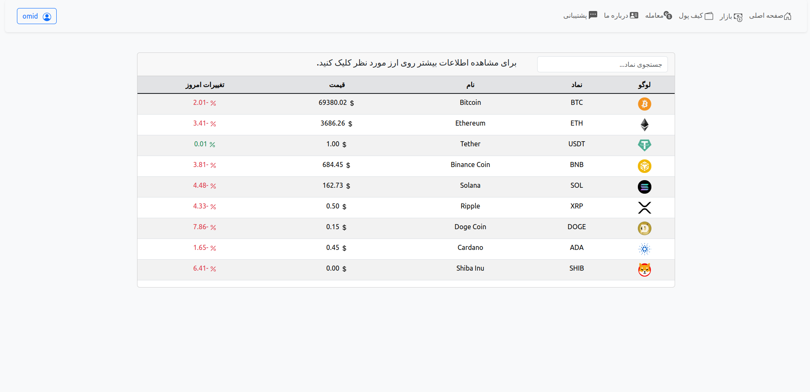
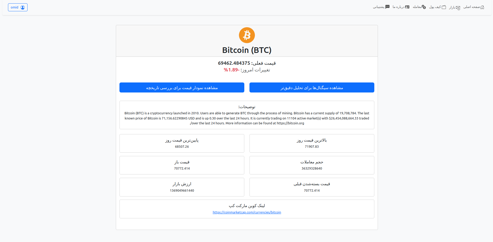
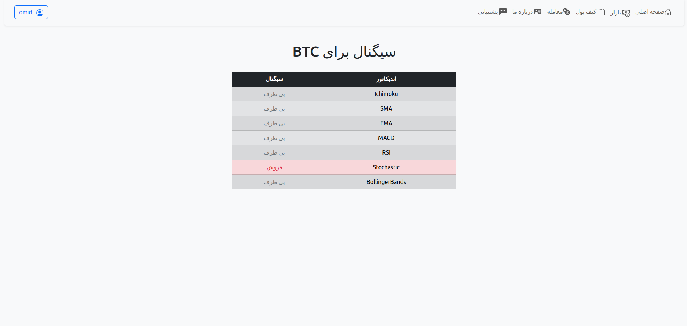
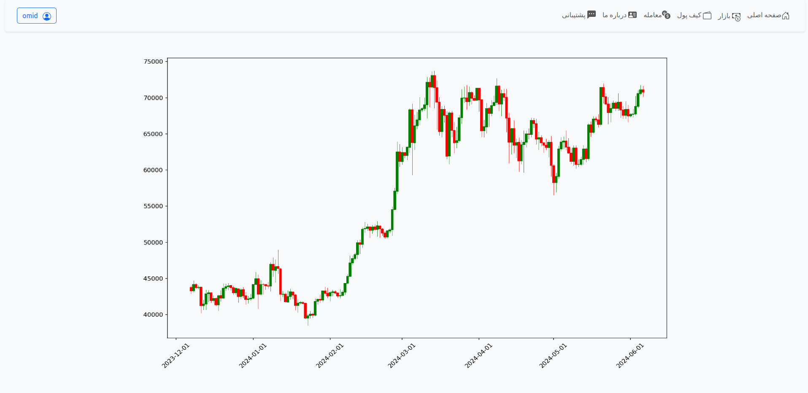
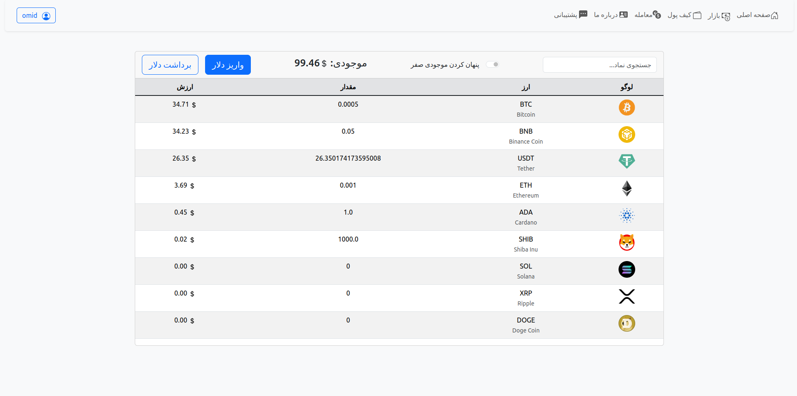
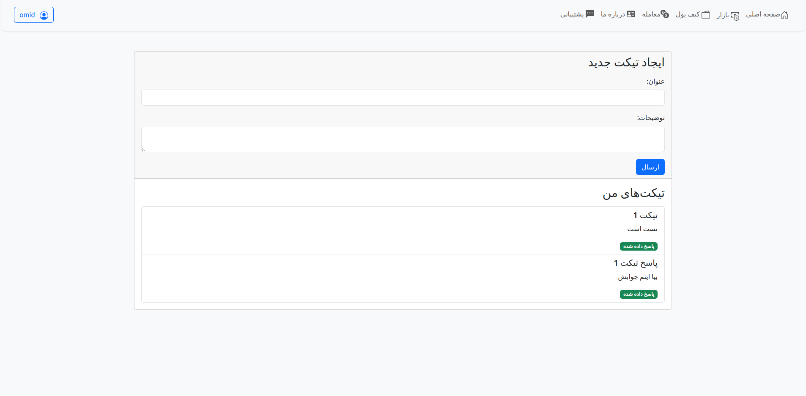
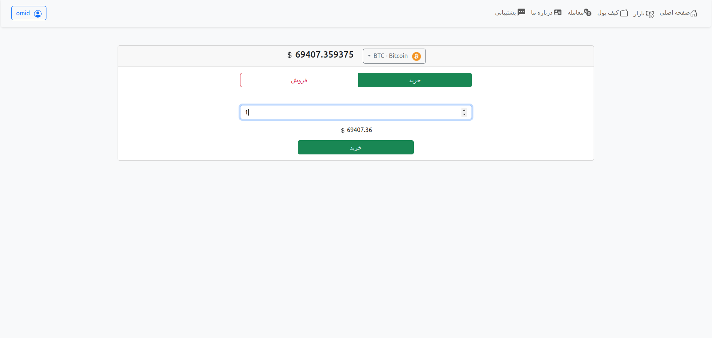
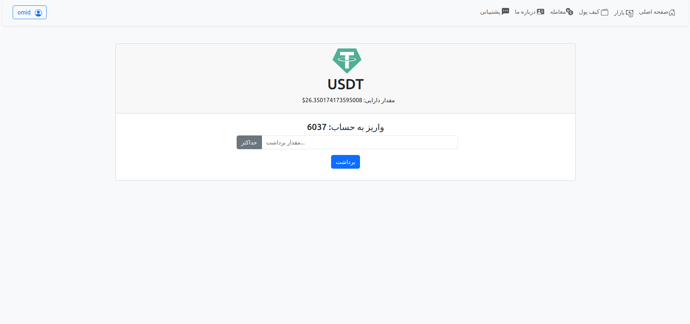

# crepto currency exchange
The project has been developed in a bachelor's degree in "System Analysis and Design" and "Software Engineering" with Django and Bootstrap.


# App images

### home page


### login page


### market page


### currency info page


### signal page


### chart page


### wallet page


### ticket page


### trade page


### deposit and withdraw page



# Setup and Installation
#### Creating virtual environments
```bash
  python3 -m virtualenv ".venv"
```
#### Activate virtual environments
```bash
  source .venv/bin/activate  
```
#### Requirements installation 
```bash
  python3 -m pip install -r requirements.txt
```
#### database
```bash
  python3 manage.py migrate
```
#### server execution
```bash
  python3 manage.py runserver
```
